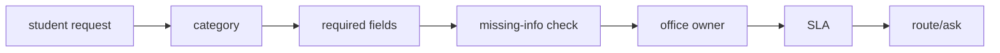

# Architecture

## Rule map
Each supported category maps to an owning office, required fields, and SLA hint.

## Ticket
Carries category, supplied fields, and an event trail.

## Evidence check
Missing required information produces ASK rather than routing an incomplete case.

## Routing
Complete supported requests return the responsible administrative office.

## Design principle
Administrative copilots should surface missing information and ownership instead of fabricating institutional answers.
